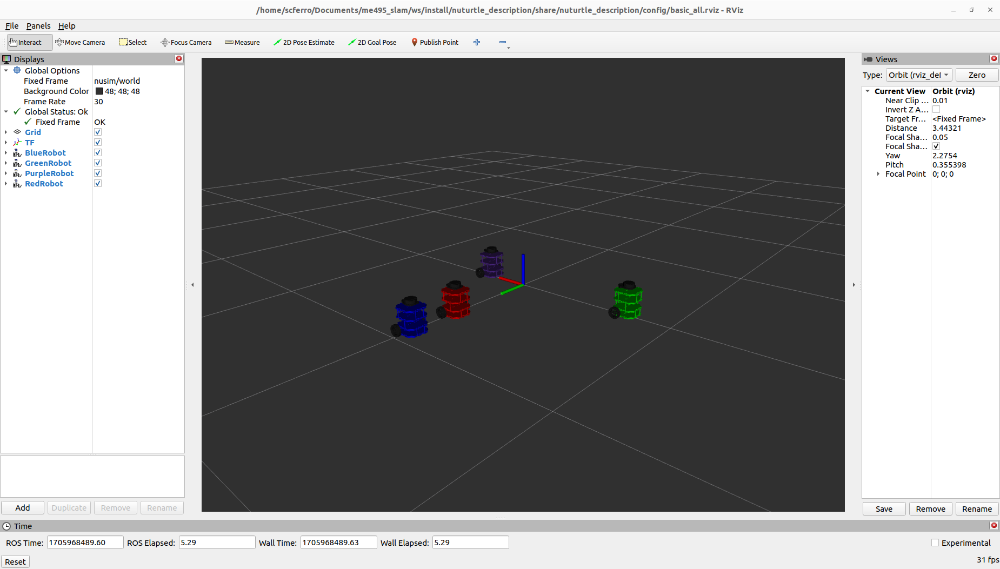

# Nuturtle  Description
URDF files for NUturtle
* `ros2 launch nuturtle_description load_one.launch.py` to see the robot in rviz.
* `ros2 launch nuturtle_description load_all.launch.xml` to see four copies of the robot in rviz.

* The rqt_graph when all four robots are visualized (Nodes Only, Hide Debug) is:

# Launch File Details
* `<Command To Show Arguments of load_one.launch.py>`
  `<Output of the Above Command>`
* `<Command To Show Arguments of load_all.launch.py>`
  `<Output of the Above Command>`